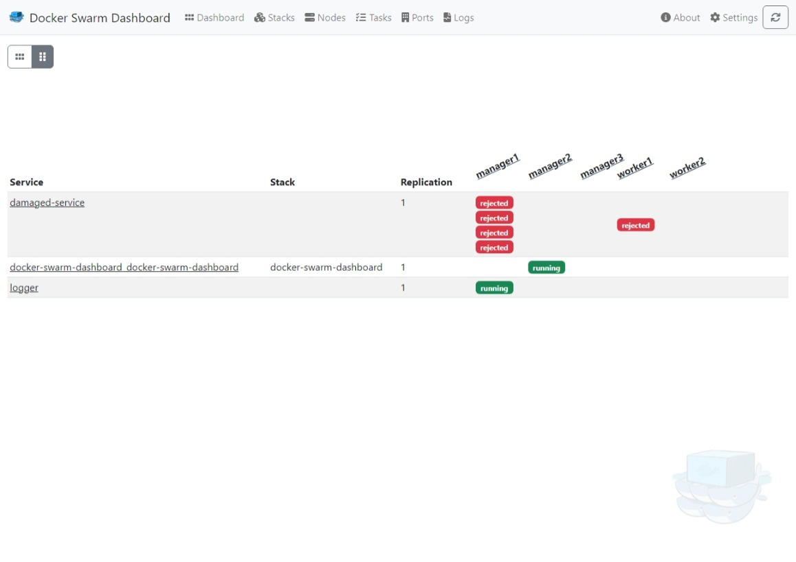
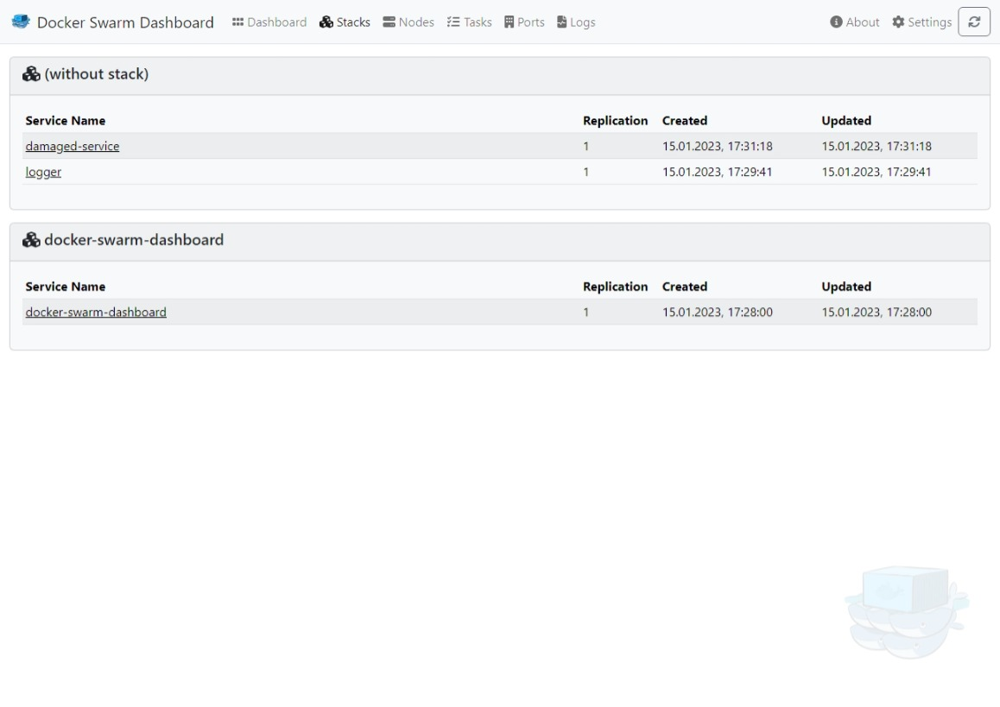
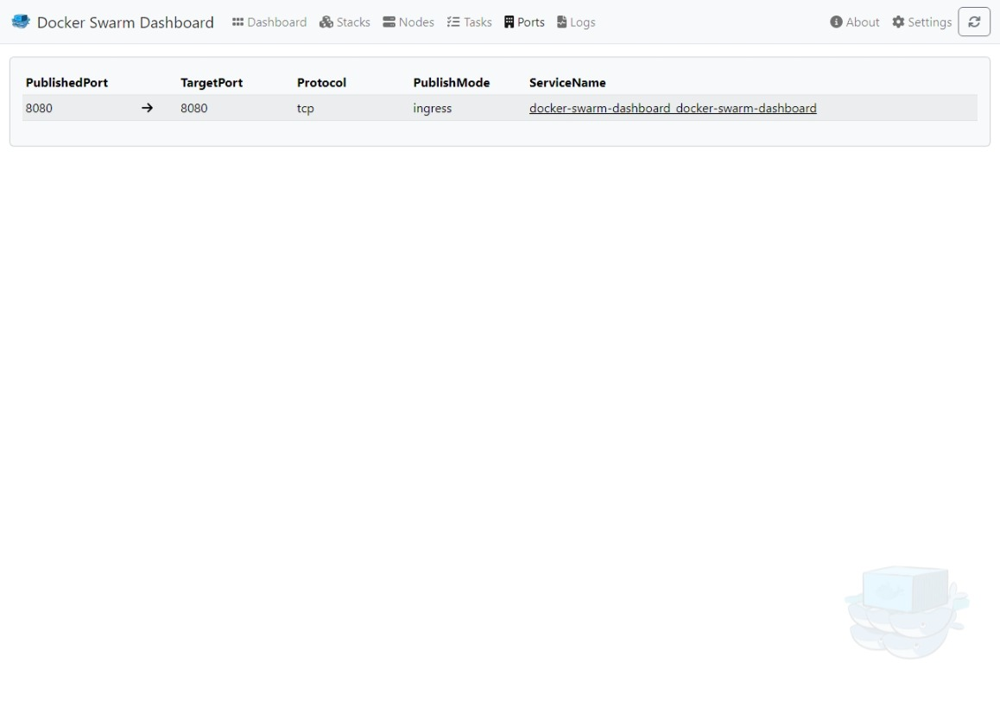
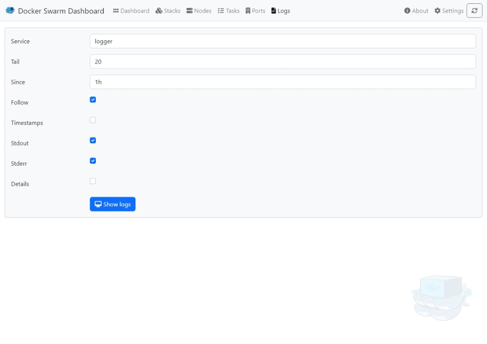
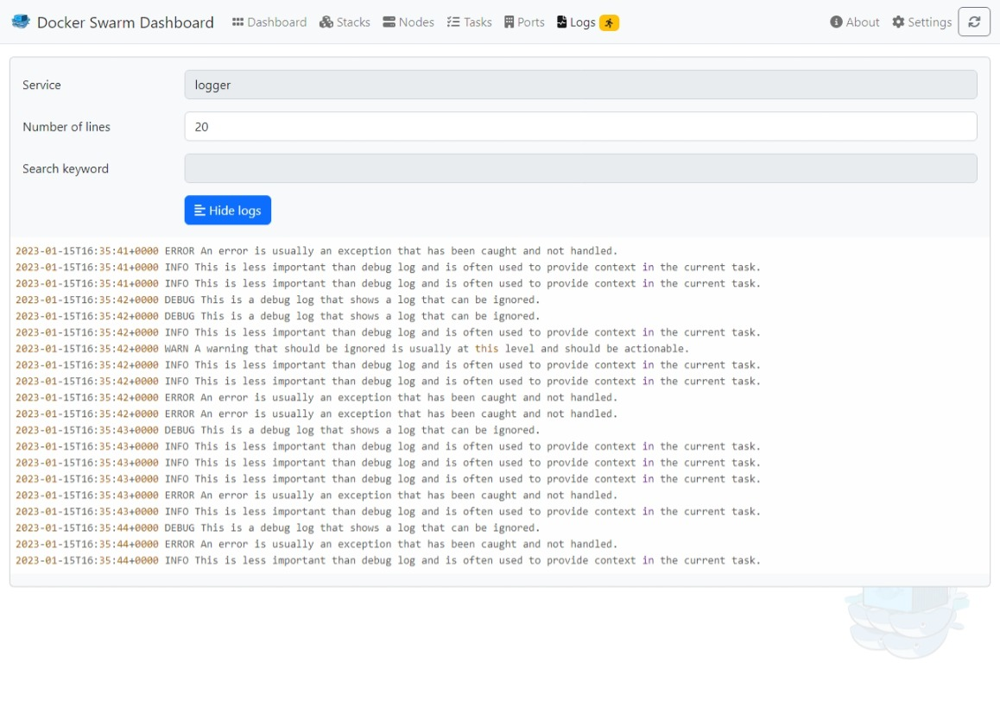

# docker-swarm-dashboard
Dashboard for Docker Swarm Cluster

Docker-Image Size: < 25 MB

_Use a stable release in production, not the master-build!
Don't expose this service to the world! The endpoints offer the configuration of your services._

If you like this project, please give a ⭐ on github.
Feedback would be nice.

- [Tools](#tools)
- [Frameworks & Libraries](#frameworks--libraries)
- [Screenshots](#screenshots)
- [Getting started](#getting-started)
- [Development](#development)

----
## Tools
Special thanks to JetBrains for supporting this project with <a href="https://www.jetbrains.com/community/opensource/#support" target="_blank">Open Source development licenses</a>.

<a href="https://www.jetbrains.com/" target="_blank"></a>
                <a href="https://www.jetbrains.com/go/" target="_blank"></a>
                <a href="https://www.jetbrains.com/webstorm/" target="_blank"></a>

----
## Frameworks & Libraries
- [ApexCharts](https://apexcharts.com/)
- [Bootstrap](https://getbootstrap.com/)
- [Cypress](https://www.cypress.io/)
- [Fontawesome](https://fontawesome.com/)
- [Gorilla](https://www.gorillatoolkit.org/)
- [Jotai](https://jotai.org/)
- [React](https://reactjs.org/)

----
## Screenshots










----
## Getting started
### Tags
|Tag|Description|Image|
|---|---|---|
|e.g. 1.4.1|Stable release|ghcr.io/heckenmann/docker-swarm-dashboard:1.4.1|
|latest|Latest stable release|ghcr.io/heckenmann/docker-swarm-dashboard:latest|
|master|Current unstable master-build (not well tested)|ghcr.io/heckenmann/docker-swarm-dashboard:master|

### Configuration
Docker Swarm Dashboard supports environment variables for configuration

* `DSD_HANDLE_LOGS`: Set to `false` to prevent fetching and displaying logs.
* `DSD_DASHBOARD_LAYOUT`: Default dashboard layout. Either `row` (default) or `column`.
* `DSD_HIDE_SERVICE_STATES`: Comma-separated list of states to not show in the main dashboard.
* `LOCALE`: Timestamp format based on a [BCP 47](https://www.rfc-editor.org/bcp/bcp47.txt) language tag.
* `TZ`: [IANA Time zone](https://www.iana.org/time-zones) to display timestamps in.

### Pull Image from ghcr.io
```
docker pull ghcr.io/heckenmann/docker-swarm-dashboard:master
```
----
### docker-compose.yml
```
---
version: '3.5'

services:
  docker-swarm-dashboard:
    image: ghcr.io/heckenmann/docker-swarm-dashboard:master
    deploy:
      replicas: 1
      placement:
        constraints:
          - node.role == manager
    ports:
      - "8080:8080"
    volumes:
      - "/var/run/docker.sock:/var/run/docker.sock"
    environment:
      DOCKER_API_VERSION: 1.35
```
----
### docker-compose.yml with traefik and basic auth
This configuration sets a password for access. It is importand to configure ssl in traefik for better security.

In this example you can login with "**docker / docker**" on port 8080.

Have a look at https://doc.traefik.io/traefik/user-guides/docker-compose/acme-tls/
```
---
version: '3.5'

services:
  docker-swarm-dashboard:
    image: ghcr.io/heckenmann/docker-swarm-dashboard:master
    deploy:
      replicas: 1
      placement:
        constraints:
          - node.role == manager
      labels:
        - "traefik.enable=true"
        - "traefik.http.routers.dsd.entrypoints=web"
        - "traefik.http.routers.dsd.middlewares=basic-auth"
        - "traefik.http.services.dsd.loadbalancer.server.port=8080"
        - "traefik.http.routers.dsd.rule=PathPrefix(`/`)"
        # Login with docker / docker
        - "traefik.http.middlewares.basic-auth.basicauth.users=docker:$$2y$$10$$81nFbUw842iBd7MlngMR4.1VBI9j6Y.vTiamBAqtVNfs4qehzZB.e"
    volumes:
      - "/var/run/docker.sock:/var/run/docker.sock"
    environment:
      DOCKER_API_VERSION: 1.35

  traefik:
    image: "traefik:v2.9"
    deploy:
      placement:
        constraints:
          - node.role == manager
    command:
      #- "--log.level=debug"
      #- "--api.insecure=true"
      - "--providers.docker=true"
      - "--providers.docker.swarmMode=true"
      - "--providers.docker.exposedbydefault=false"
      - "--entrypoints.web.address=:8080"
    ports:
      - "8080:8080"
    volumes:
      - "/var/run/docker.sock:/var/run/docker.sock:ro"
```

----
### Deploy on docker-swarm
From the directory with docker-compose.yml run:
```
docker stack deploy --compose-file docker-compose.yml docker-swarm-dashboard
```

----
### logs-generator (for testing)
```
docker service create --name logger chentex/random-logger:latest 50 200
```

## Development
### Local Build
```
docker build -t ghcr.io/heckenmann/docker-swarm-dashboard:local .
```

### Run api-mock-server
```
# from app-src
yarn run start-api-mock
```
### Run UI
```
# from app-src
yarn run start-dev-server
```
When you run the UI with the api-mock-server, you have to open the ui with "base"-param (API-URL):
http://localhost:3000#base="http%3A%2F%2Flocalhost%3A3001%2F"

### Run UI-tests
```
# from app-src
yarn run cy:run
```